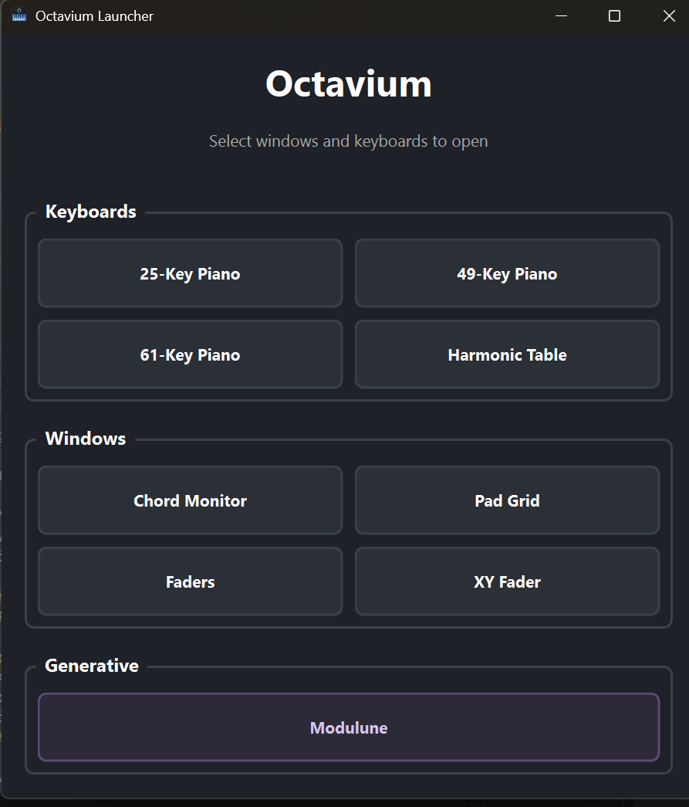
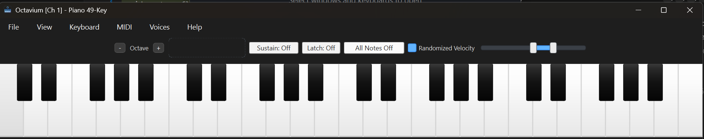
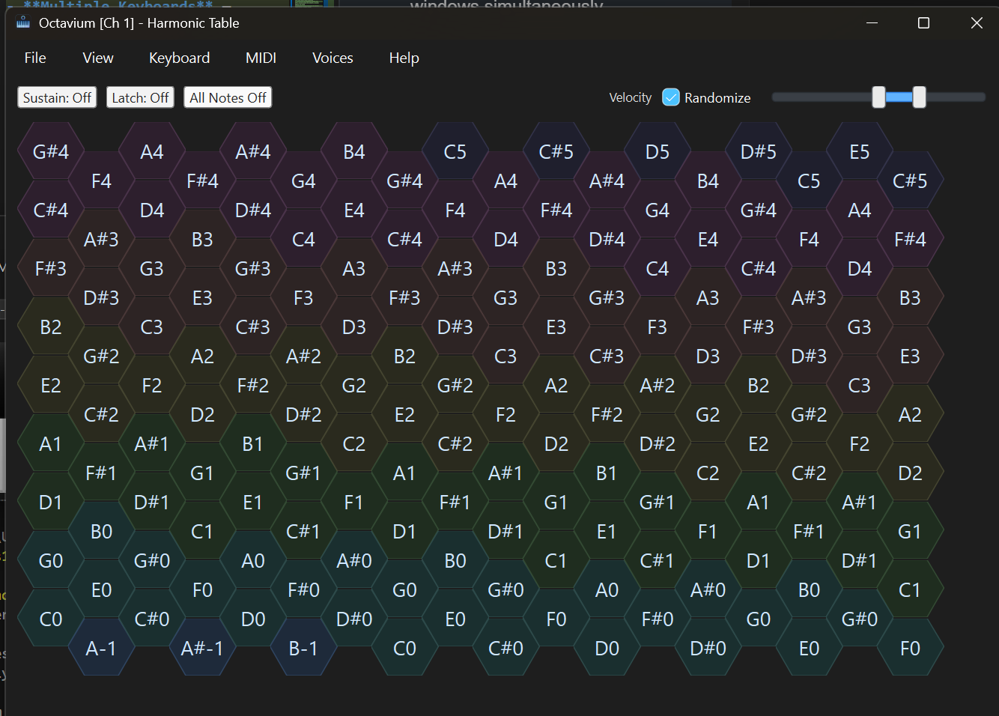
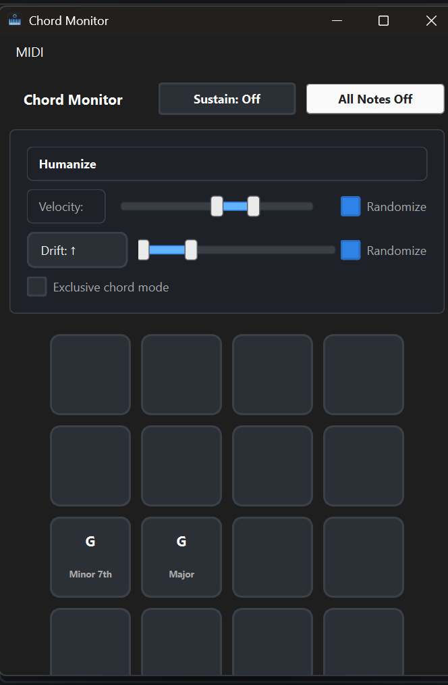
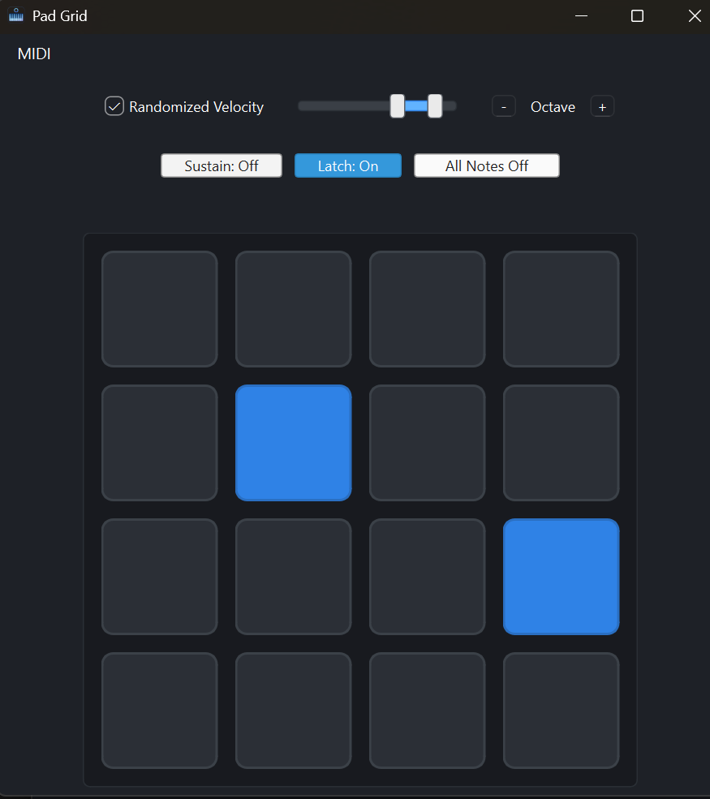
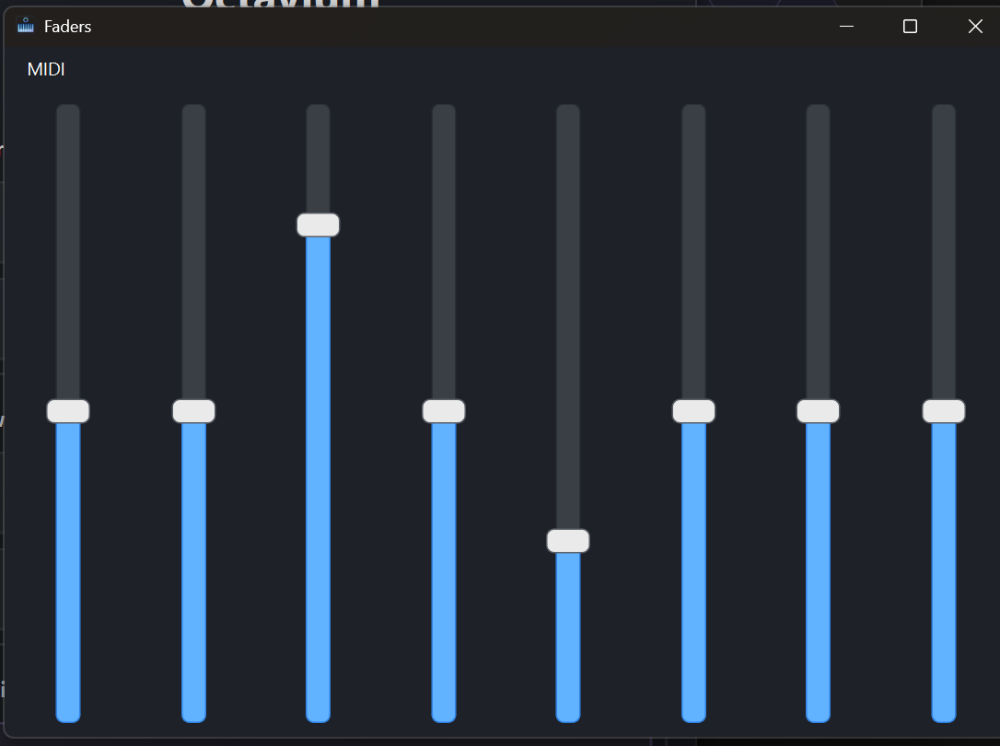
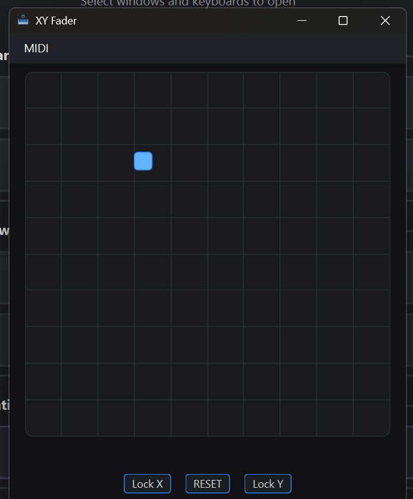

<p align="center">
  
</p>

# Octavium 🎹

An accessibility-first, mouse-driven virtual MIDI keyboard for making music without a physical keyboard. Designed for creators who primarily use a mouse (including users with motor disabilities), Octavium focuses on clear visuals, reliable mouse interactions, and features like sustain and latch that make performance and composition possible without traditional keybeds.

Built with **PySide6**, **mido**, and **pygame**.

---

## Features

### Launcher & Multi-Window Support
- **Launcher Window** — Central hub to open multiple keyboards and windows simultaneously
- **Multiple Keyboards** — 25-key, 49-key, 61-key, 73-key, 76-key, and 88-key pianos, plus Harmonic Table
- **Standalone Windows** — Chord Monitor, Pad Grid, Faders, XY Fader, and Modulune can be opened independently
- **Shared MIDI** — All windows share a single MIDI output to avoid port conflicts

### Mouse-First Design
- **Click to play** — Click any key to play it
- **Click and drag** — Glide across keys for expressive runs
- **Right-click latch** — Right-click any key to toggle latch on that specific note (enabled by default)
- **Clear visual feedback** — Pressed and held states are visually distinct

### Sustain & Latch
- **Sustain** — Keeps notes sounding after mouse release; visuals clear on release so you can see what you touched
- **Latch** — Toggles notes on/off; click once to start, click again to stop
- **Right-Click Latch** — Latch individual notes with right-click while using normal clicks for regular playing

### Controls
- **Velocity slider** — Adjust note velocity (20–127) with linear, soft, or hard response curves
- **Octave controls** — Shift the keyboard range up or down
- **Scale quantization** — Snap notes to a scale to avoid wrong notes
- **Polyphony options** — Limit voices (1–8) or run unlimited
- **MIDI channel selection** — Route to any of 16 MIDI channels

### Chord Monitor
- **4×4 grid** of chord cards for quick access to saved chords
- **Hold-to-play** — Hold a card to play the chord, release to stop
- **Humanize controls** — Add velocity and timing variation for natural feel
- **Drag-and-drop** — Rearrange cards or move to empty slots
- **Drag-to-edit** — Drag a card to the keyboard to load and edit, then drag back to save

### Additional Surfaces
- **Harmonic Table** — Isomorphic hex layout with harmonic relationships
- **4×4 Pad Grid** — Drum pad grid for triggering samples
- **Faders** — 8 MIDI CC faders with configurable CC numbers
- **XY Fader** — 2D pad for expressive control of two CCs

---

## Screenshots

### Launcher
<p align="center">
  
</p>

### 49-Key Piano
<p align="center">
  
</p>

### Harmonic Table
<p align="center">
  
</p>

### Chord Monitor
<p align="center">
  
</p>

### Pad Grid
<p align="center">
  
</p>

### Faders
<p align="center">
  
</p>

### XY Fader
<p align="center">
  
</p>

---

## Quick Start

### Prerequisites
- Python 3.9+ (tested with Python 3.13)
- Windows, macOS, or Linux
- Virtual MIDI port (e.g., [loopMIDI](https://www.tobias-erichsen.de/software/loopmidi.html) on Windows)

### Installation

```bash
# Clone the repository
git clone https://github.com/owenpkent/Octavium.git
cd Octavium

# Create and activate virtual environment
python -m venv venv
venv\Scripts\activate      # Windows
# source venv/bin/activate  # macOS/Linux

# Install dependencies
pip install -r requirements.txt

# Run Octavium
python run.py
```

---

## Usage

### Launcher Window

When you run Octavium, the launcher window appears with options to open:

| Keyboards | Windows | Generative |
|-----------|---------|------------|
| 25-Key Piano | Chord Monitor | Modulune |
| 49-Key Piano | Pad Grid | |
| 61-Key Piano | Faders | |
| Harmonic Table | XY Fader | |

Open multiple windows simultaneously — the launcher stays open for easy access.

### Mouse Interactions

| Action | Result |
|--------|--------|
| **Click** a key | Play the note |
| **Click and drag** | Glide across keys |
| **Right-click** a key | Toggle latch on that note |
| **Release** | Stop note (unless sustained or latched) |

### Keyboard Shortcuts

| Key | Action |
|-----|--------|
| `Z` | Octave down |
| `X` | Octave up |
| `1` | Soft velocity curve |
| `2` | Linear velocity curve |
| `3` | Hard velocity curve |
| `Q` | Toggle scale quantization |
| `Esc` | All notes off (panic) |
| `Ctrl++` / `Ctrl+=` | Zoom in |
| `Ctrl+-` | Zoom out |

### View Menu Options

- **Show Mod Wheel** — Display modulation wheel
- **Show Pitch Wheel** — Display pitch bend wheel
- **Hold Visuals During Sustain** — Keep keys visually pressed while sustained
- **Chord Monitor** — Open the chord monitor window
- **Drag While Sustain** — Allow dragging across keys while sustain is on
- **Right-Click Latch** — Enable/disable right-click latch behavior
- **Zoom** — Scale the UI (50%–200%)

### Keyboard Menu

Switch between different layouts:
- **Piano sizes**: 25, 49, 61, 73, 76, 88 keys
- **4×4 Beat Grid**: 16-pad drum grid
- **Faders**: 8 CC faders
- **XY Fader**: 2D control pad
- **Harmonic Table**: Isomorphic hex layout

### Harmonic Table

The Harmonic Table is an isomorphic layout where:
- **Horizontal movement** = perfect fifths
- **Diagonal movement** = major/minor thirds
- **Octave-based colors** help with visual navigation
- **Duplicate note highlighting** shows all instances of the same pitch
- Default base note is C2 at the lower-left

---

## MIDI Setup

### Windows (loopMIDI)

1. Download and install [loopMIDI](https://www.tobias-erichsen.de/software/loopmidi.html)
2. Create a virtual MIDI port (e.g., "loopMIDI Port 1")
3. Configure your DAW to receive MIDI from this port

### macOS (IAC Driver)

1. Open **Audio MIDI Setup**
2. Window → Show MIDI Studio
3. Double-click **IAC Driver**
4. Enable "Device is online"
5. Add a port if needed

### Selecting a Port

Use **MIDI → Select Output Port** to choose your MIDI destination. When using the launcher, all windows share the same MIDI output.

---

## Architecture

```
Octavium/
├── run.py                    # Entry point
├── app/
│   ├── launcher.py           # Launcher window
│   ├── main.py               # Main keyboard window
│   ├── keyboard_widget.py    # Piano keyboard widget
│   ├── harmonic_table.py     # Harmonic table widget
│   ├── chord_monitor_window.py  # Chord monitor
│   ├── pad_grid.py           # 4×4 pad grid
│   ├── faders.py             # CC faders
│   ├── xy_fader.py           # XY fader pad
│   ├── midi_io.py            # MIDI output abstraction
│   ├── scale.py              # Scale quantization
│   └── themes.py             # UI styling
└── modulune/                 # Generative engine (see below)
```

---

# Modulune 🌙

**Generative Impressionistic Piano Engine**

Modulune is Octavium's generative counterpart. While Octavium gives users direct expressive control over MIDI performance, Modulune creates musical intention autonomously—generating continuously evolving piano textures in real time.

## Philosophy

| Octavium | Modulune |
|----------|----------|
| The **instrument** | The **player** |
| Direct expressive control | Algorithmic creativity |
| User-driven | System-driven |

Both share the same philosophy: **accessibility**, **experimentation**, and **musical exploration**—allowing anyone to produce rich, evolving piano textures either interactively or fully autonomously.

## Features

- **Dual-hand generation** — Independent left and right hand textures
- **Right hand textures**: Shimmering Chords, Flowing Arpeggios, Melodic Fragments, Sparse Meditation, Layered Voices, Impressionist Wash
- **Left hand textures**: Sustained Bass, Broken Chords, Alberti Bass, Block Chords, Rolling Octaves, Sparse Roots
- **Real-time controls** — Adjust tempo, key, mode, density, and tension while playing
- **Expressive timing** — Rubato, swing, and humanization
- **Dynamic modulation** — Automatic key and mode changes
- **GUI and CLI** — Launch from the Octavium launcher or run from command line

## Using Modulune

### From the Launcher (Recommended)

1. Run Octavium: `python run.py`
2. Click **Modulune** in the Generative section
3. Use the GUI controls to adjust parameters
4. Click **Play** to start generating

### From Command Line

```bash
# Basic usage
python -m modulune.main

# With custom parameters
python -m modulune.main --tempo 60 --key Db --mode lydian

# List available MIDI ports
python -m modulune.main --list-ports
```

### Command Line Options

| Option | Description | Default |
|--------|-------------|---------|
| `--tempo` | Tempo in BPM | 72 |
| `--key` | Key root (C, Db, F#, etc.) | C |
| `--mode` | Scale mode | major |
| `--density` | Note density (0.0–1.0) | 0.5 |
| `--tension` | Harmonic tension (0.0–1.0) | 0.3 |
| `--texture` | Texture type | impressionist_wash |
| `--port` | MIDI port name | auto |

### Available Modes

`major`, `natural_minor`, `harmonic_minor`, `melodic_minor`, `dorian`, `phrygian`, `lydian`, `mixolydian`, `aeolian`, `locrian`, `whole_tone`, `pentatonic_major`, `pentatonic_minor`, `blues`

---

## DAW Integration

### Step 1: Create a Virtual MIDI Port

**Windows:** Use [loopMIDI](https://www.tobias-erichsen.de/software/loopmidi.html)

**macOS:** Use IAC Driver (Audio MIDI Setup → Show MIDI Studio → IAC Driver)

### Step 2: Configure Your DAW

| DAW | Setup |
|-----|-------|
| **Ableton Live** | Preferences → Link/Tempo/MIDI → Enable port → Create MIDI track → Set input |
| **FL Studio** | Options → MIDI Settings → Enable port → Add VST → Set input |
| **Logic Pro** | Preferences → MIDI → Create Software Instrument → Record-enable |
| **Reaper** | Preferences → MIDI Devices → Enable port → Create track → Arm |

### Step 3: Start Modulune

Launch from the Octavium launcher or run:
```bash
python -m modulune.main --port "loopMIDI Port 1"
```

---

## License

This project is licensed under the MIT License - see the [LICENSE](LICENSE) file for details.

---

**Happy music making! 🎵**
