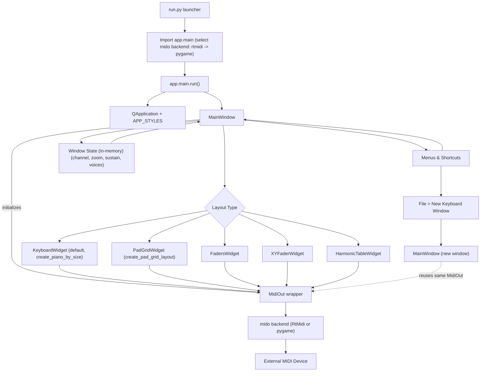

# Octavium System Overview

This diagram illustrates how control flows from the CLI launcher into the Qt application, how the main window manages different performance surfaces, and how MIDI messages reach external devices.

